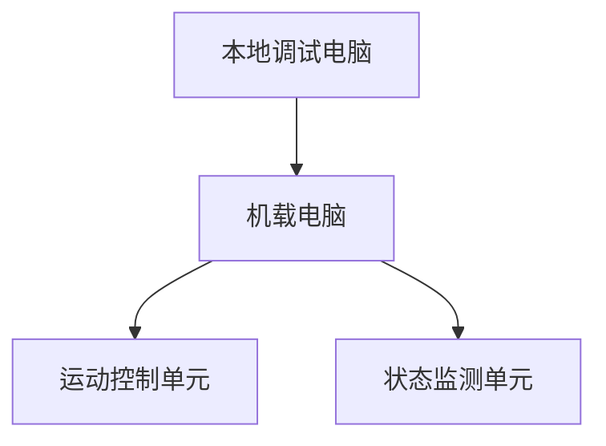

# 水下机器人控制系统文档🎈🎈🎈

由于个人使用习惯问题并没有采用 tf 坐标系来控制机器😂😂😂

## 机载控制系统

文件结构如下

```shell
.
├── install
├── build
├── log
├── config.json
├── datas
│   └── pid_parameters.json
├── readme.md
├── scripts
│   ├── run
│   │   ├── image_transport.sh
│   │   ├── permissions.sh
│   │   ├── rebuild.sh
│   │   └── timeupdate.sh
│   └── test
└── src
    ├── uv_control_py
    │   ├── package.xml
    │   ├── resource
    │   │   └── uv_control_py
    │   ├── setup.cfg
    │   ├── setup.py
    │   ├── test
    │   │   ├── test_copyright.py
    │   │   ├── test_flake8.py
    │   │   └── test_pep257.py
    │   └── uv_control_py
    │       ├── __init__.py
    │       ├── uv_cmd_pannel.py
    │       └── uv_core.py
    ├── uv_msgs
    │   ├── CMakeLists.txt
    │   ├── include
    │   │   └── uv_msgs
    │   ├── msg
    │   │   ├── CabinState.msg
    │   │   ├── Pid.msg
    │   │   ├── PidParameters.msg
    │   │   ├── PropellerThrust.msg
    │   │   ├── RobotAxis.msg
    │   │   └── WorkState.msg
    │   ├── package.xml
    │   └── src
    └── uv_vision_py
        ├── package.xml
        ├── resource
        │   └── uv_vision_py
        ├── setup.cfg
        ├── setup.py
        ├── test
        │   ├── test_copyright.py
        │   ├── test_flake8.py
        │   └── test_pep257.py
        └── uv_vision_py
            ├── __init__.py
            ├── uv_capture.py
            └── uv_imshow.py
```

编译方法：

在该工作空间下使用`rebuild.sh`脚本

```shell
bash scripts/run/rebuild.sh
```


### 视觉部分  uv_vision_py

视觉部分节点包含在功能包`uv_vision_py`中

#### uv_capture

这是一个用于捕获并矫正发布图像的节点

有两个启动参数`--front-cam` `--back-cam`用于指定输入的摄像机设备，当其中一个参数的输入值被设置为`none`时，该设备将不会被打开

该节点发布话题

* `front_cam_image/raw` 前置摄像头图像
* `back_cam_image/raw`后置摄像头图像

使用示例

```shell
ros2 run uv_control_py uv_core --front-cam "/dev/video0" --back-cam "/dev/video1"
```


#### uv_imshow

这是一个用于展示图像的节点，该节点功能可由rqt完全替代，现已弃用

该节点展示话题`image_data_uncompressed`下的图像信息

### 控制部分  uv_control_py

控制部分节点包含在功能包`uv_control_py`中

#### uv_core

该节点负责一切与核心板的通信任务

有一个启动参数`--cfg` 用于指示配置文件路径

该节点发布话题

* `cabin_state`  舱内状态参数，类型为`CabinState`
* `propeller_thrust`  推进器推力参数，类型为`PropellerThrust`
*  `robot_position`  机器人位置参数，类型为`RobotAxis`
*  `robot_speed`  机器人速度参数，类型为`RobotAxis`
* `pid_parameters`  PID参数，类型为`PidParameters`

该节点订阅话题

* `openloop_thrust`  开环模式推力参数，类型为`RobotAxis`
* `servo_control`  舵机角度参数，类型为`CabinState`
* `pid_set`  设置的PID参数，类型为`PidParameters`
* `work_state`  机器人工作模式参数，类型为`WorkState`

使用示例

```shell
ros2 run uv_control_py uv_core --cfg '/home/macabaka/Workspace/Rosws/core_config.json'
```


#### uv_cmd_pannel

该节点用于在shell中展示机器人状态，并控制机器人移动

请注意，在shell中结束该节点时请使用`CTRL`+`Z`以避免shell界面中错行的问题

该节点发布话题

* `openloop_thrust`  开环模式推力参数，类型为`RobotAxis`
* `servo_control`  舵机角度参数，类型为`CabinState`
* `work_state`  机器人工作模式参数，类型为`WorkState`

该节点订阅话题

* `cabin_state`  舱内状态参数，类型为`CabinState`
* `propeller_thrust`  推进器推力参数，类型为`PropellerThrust`
* `robot_position`  机器人位置参数，类型为`RobotAxis`
* `robot_speed`  机器人速度参数，类型为`RobotAxis`

使用示例

```shell
ros2 run uv_control_py uv_cmd_pannel
```


### ROS2消息定义  uv_msgs

该功能包中定义了所有使用的ROS2消息类型

* `CabinState`

```cpp
float32 temp
float32 hum
uint8 leak
float32 voltage
float32[2] servo
```

* `PidParameters`

```cpp
uint8 aix
float32 p
float32 i
float32 d
float32 i_limit
```

* `PidParametersSum`

```cpp
float32[4] x #0~3 p,i,d,i_limit
float32[4] y
float32[4] z
float32[4] roll
float32[4] pitch
float32[4] yaw
```

* `PropellerThrust`

```cpp
float32[6] thrust
```

* `RobotAxis`

```
float32 x
float32 y
float32 z
float32 roll
float32 yaw
float32 pitch
```

* `WorkState`

```cpp
uint8 state
```


## 通信结构

### 结构构成



### 协议内容
#### 机载电脑-->运动控制单元
##### 格式

| 位数 |               | 内容 |
| ---- | ------------------------ |   |
| 0~1  | 起始位             | 0xfa 0xaf |
| 2  | 内容标志位 | 内容含义                             |
| 3~N-2 | 内容信息 | 机器人信息，由具体内容决定 |
| N-1 ~ N | 终止位 | 0xfb 0xbf |

##### 内容

###### 机器人运动参量

对应内容标志位`0x01`

注意，使用此指令设置机器人工作状态时，位置、姿态、速度、角速度需置零。

|内容|数据类型|位宽|内容|
|---|---|---|---|
|发布者/控制指令|uint8|1|slam` 0x10` ; Mems ` 0x11 ` ; IMU `0x13 `; 开环工作`0x00`; 定姿  定深`0x01`;  定姿  定深  定向`0x02` ; 定位 `0x03`|
|位置|float [3]|3*4|x,y,z|
|姿态|float [3]|3*4| roll,pitch,yaw                               |
|速度|float [3]|3*4|x,y,z|
|角速度|float[3]|3*4|roll,pitch,yaw|

###### PID参数

对应内容标志位`0x02`

|内容|数据类型|位宽|内容|
|---|---|---|---|
|指定轴|uint8|1|0x01 X ； 0x02 Y  ；0x03 Z  ；0x04 roll ；0x05 pitch  ； 0x06 yaw|
|P|float|4|比例参量|
|I|float|4|积分参量|
|D|float|4|微分参量|
|I limit|float|4|积分限幅|

###### 电机PWM输出数据

对应内容标志位`0x03`

|内容|数据类型|位宽|内容|
|---|---|---|---|
|电机1PWM输出数据|uint16|2|对应电机1|
|电机2PWM输出数据|uint16|2|对应电机2|
|电机3PWM输出数据|uint16|2|对应电机3|
|电机4PWM输出数据|uint16|2|对应电机4|
|电机5PWM输出数据|uint16|2|对应电机5|
|电机6PWM输出数据|uint16|2|对应电机6|

###### 推力数据

对应内容标志位`0x04`

该条信息主要用于上行时输出电机数据。

|内容|数据类型|位宽|内容|
|---|---|---|---|
|电机1推力输出数据|float|6|对应电机1|
|电机2推力输出数据|float|6|对应电机2|
|电机3推力输出数据|float|6|对应电机3|
|电机4推力输出数据|float|6|对应电机4|
|电机5推力输出数据|float|6|对应电机5|
|电机6推力输出数据|float|6|对应电机6|

###### 推力数据

对应内容标志位`0x05`

该条信息主要用于下行时控制电机旋转。

|内容|数据类型|位宽|内容|
|---|---|---|---|
|x轴推力输出数据|float|6|对应电机1|
|y轴推力输出数据|float|6|对应电机2|
|z轴推力输出数据|float|6|对应电机3|
|roll轴推力输出数据|float|6|对应电机4|
|pitch轴推力输出数据|float|6|对应电机5|
|yaw轴推力输出数据|float|6|对应电机6|

#### 机载电脑-->状态监测单元

##### 机器人舱内数据

对应内容标志位`0x06`

| 内容  | 数据类型 | 位宽 | 内容                 |
| ----- | -------- | ---- | -------------------- |
| 温度  | uint8    | 1    | 就是实际温度         |
| 湿度  | uint8    | 1    | 0~255 对应0~100%     |
| 漏水  | uint8    | 1    | 1为漏水 0为未漏水    |
| 电压  | uint8    | 1    | 0~255对应0~12V       |
| 舵机1 | uint8    | 1    | 0~255 对应零位到满转 |
| 舵机2 | uint8    | 1    | 0~255 对应零位到满转 |

